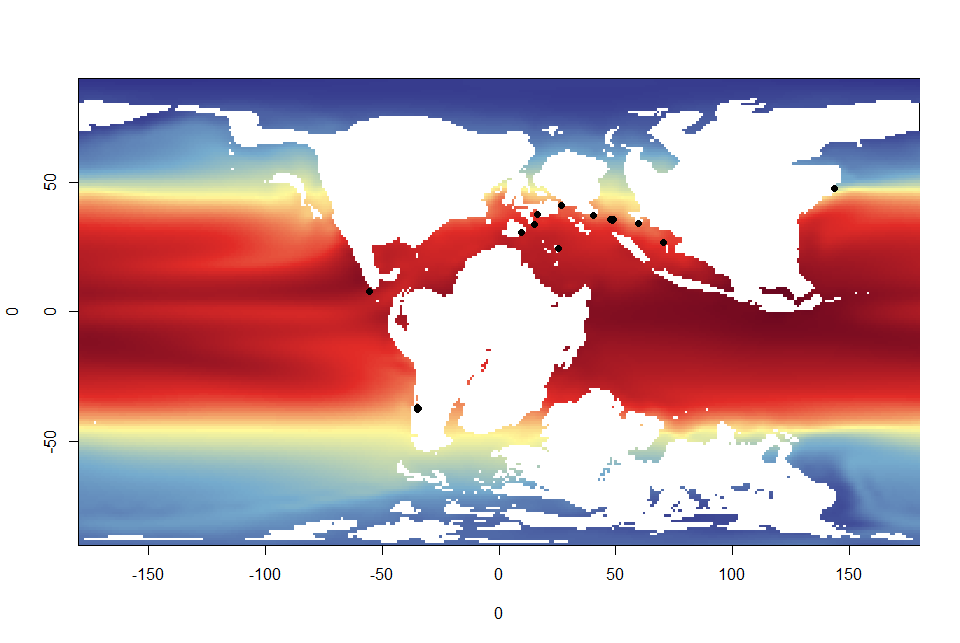
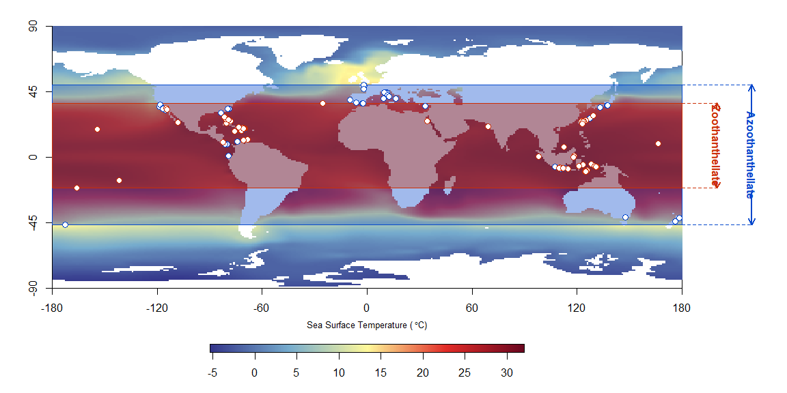
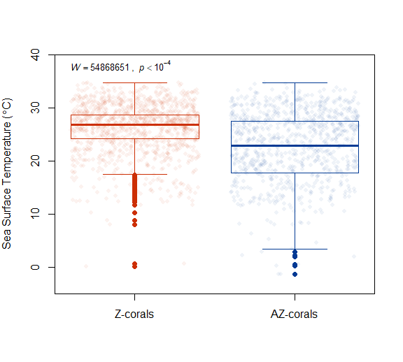
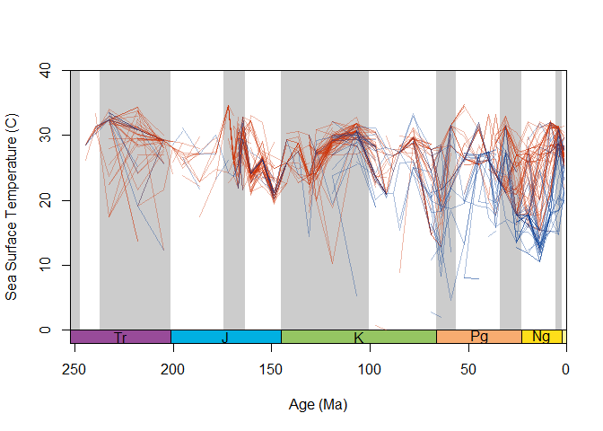
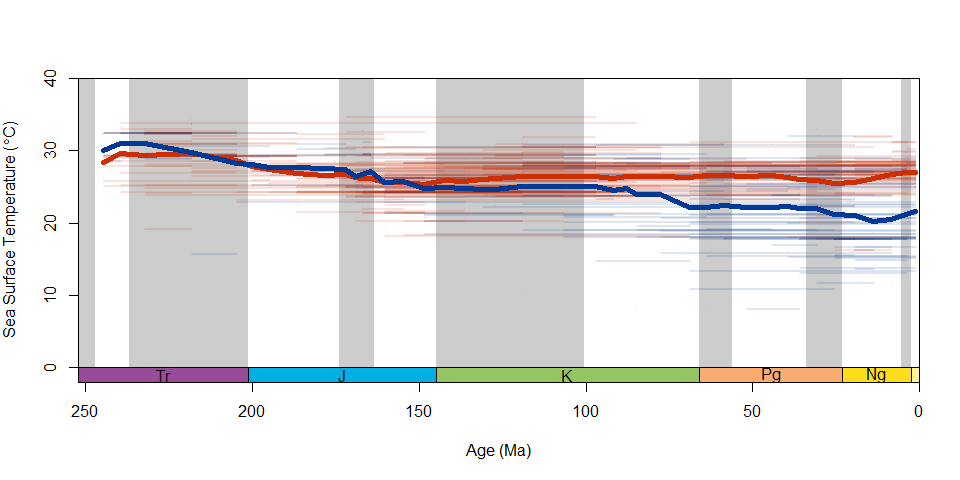

Example application for the chronosphere package
================
Ádám T. Kocsis, Paulina Nätscher & Nussaïbah B. Raja
9/20/2020

  - [Setting up the environment to work with the data load from
    chronosphere](#setting-up-the-environment-to-work-with-the-data-load-from-chronosphere)
      - [Loading libraries and custom
        functions](#loading-libraries-and-custom-functions)
      - [Setting data directory](#setting-data-directory)
      - [Loading datasets table from
        `chronosphere`:](#loading-datasets-table-from-chronosphere)
  - [Data](#data)
      - [The Paleobiology Database
        (PBDB)](#the-paleobiology-database-pbdb)
      - [Spatial data and
        reconstruction](#spatial-data-and-reconstruction)
  - [Thermal niches of scleractinian
    corals](#thermal-niches-of-scleractinian-corals)

# Setting up the environment to work with the data load from chronosphere

## Loading libraries and custom functions

``` r
# libraries
library(chronosphere)
library(divDyn)

# functions: located in github repository (https://github.com/adamkocsis/chrono_case)
source("scripts/methods/utils.R")
funky() #custom function to load all the custom functions
```

## Setting data directory

``` r
# data of the chronosphere
chronodat <- file.path("data", "chronosphere")
```

## Loading datasets table from `chronosphere`:

``` r
# datasets table from chronosphere
allDat <- datasets()
```

    ## Use datasets(dat = <dat>) to see available versions and resolutions.

``` r
head(allDat[,1:3])
```

    ##          dat  var                                                   dat_name
    ## 1     ETOPO1  bed                       ETOPO1 Global Relief Model (bedrock)
    ## 2     ETOPO1  ice                   ETOPO1 Global Relief Model (ice surface)
    ## 3    GPlates muma                                          GPlates resources
    ## 4   HadISST1  sst Hadley Centre Sea Ice and Sea Surface Temperature data set
    ## 5 macrostrat  all                                                 Macrostrat
    ## 6       meow ecos                             Marine Ecoregions of the World

# Data

## The Paleobiology Database (PBDB)

The following code downloads PBDB data directly from the `chronosphere`
package. Setting the `datadir` parameter saves the downloaded data in a
specific folder on your computer, from which it can be loaded again in
the future. This ensures that the same data is used everytime the
analyses are run.

``` r
pbdb <- fetch(dat="pbdb",datadir=chronodat) #PBDB data
traits <- fetch(dat="som", var="kiessling-coralgenera",datadir=chronodat) #coral traits data
```

We then subset the corals dataset and assign the ecological traits to
the coral genera.

``` r
#subset for scleractinian corals only
corals <- pbdb[pbdb$order =="Scleractinia",] #only scleractinia

# assign the symbiotic status
corals <- merge(
  corals, 
  unique(traits[, c("genus_detail", "genus.proper", "ECOLOGY")]), 
  by.x="genus", by.y="genus_detail", all.x=TRUE)
```

Before we can analyses the data, we will bin the data at stage level
using our custom function `AssignStages()`:

    ## function (dat) 
    ## {
    ##     data(stages, package = "divDyn")
    ##     data(keys, package = "divDyn")
    ##     stgMin <- divDyn::categorize(dat[, "early_interval"], keys$stgInt)
    ##     stgMax <- divDyn::categorize(dat[, "late_interval"], keys$stgInt)
    ##     stgMin <- as.numeric(stgMin)
    ##     stgMax <- as.numeric(stgMax)
    ##     stgMin <- as.numeric(stgMin)
    ##     stgMax <- as.numeric(stgMax)
    ##     dat$stg <- rep(NA, nrow(dat))
    ##     stgCondition <- c(which(stgMax == stgMin), which(stgMax == 
    ##         -1))
    ##     dat$stg[stgCondition] <- stgMin[stgCondition]
    ##     return(dat)
    ## }

``` r
# Assign stage to PBDB entries
corals <- AssignStages(corals)
```

We also remove any occurrences without any genus names and coordinates,
as well as those that could not be assigned to a specific stage.
Additionally, we subset the data to include coral occurrences only from
the Triassic onwards. This is done using our custom function
`CleanPBDB`:

    ## function (dat) 
    ## {
    ##     datNoNAGEN <- dat[!is.na(dat$genus.proper), ]
    ##     spName <- gsub("^.* ([[:alnum:]]+\\.?\\.?)$", "\\1", datNoNAGEN$identified_name)
    ##     genName <- gsub("(^.*) [[:alnum:]]+\\.?$", "\\1", datNoNAGEN$identified_name)
    ##     n <- grep("aff\\.|\\?|cf\\.|n\\. gen\\.|\\\"", genName)
    ##     if (length(n) > 0) 
    ##         datNoNAGEN <- datNoNAGEN[-n, ]
    ##     datNoNASTG <- datNoNAGEN[!is.na(datNoNAGEN$stg), ]
    ##     datNoCoords <- datNoNASTG[!is.na(datNoNASTG$lat) & !is.na(datNoNASTG$lng), 
    ##         ]
    ##     datOK <- datNoCoords[!datNoCoords$genus.proper == "", ]
    ##     datPast <- datOK[datOK$stg != 95, ]
    ##     datFinal <- datPast[datPast$stg > 52, ]
    ##     return(datFinal)
    ## }

``` r
# Assign stage to PBDB entries
corals <- CleanPBDB(corals)
```

We also omit collections for which no coordinates were available or
those that could not be assigned a stage.

``` r
# separate the collection data
collections <- corals[,c("collection_no", "lng", "lat", "stg", "paleolat" ,"paleolng")]
collections <- unique(collections)

# omit cases where something is missing
collections <- collections[!is.na(collections$stg) & !is.na(collections$lng) & !is.na(collections$lat), ]
```

## Spatial data and reconstruction

For our analyses, we also need sea surface temperature (SSTs) data. The
following were computed by Valdes et al. (in prep) and contain
extrapolated SSTs for some stages:

``` r
tos <- fetch(dat="had-stage", var="tos-extra", res=1, datadir=chronodat)
```

We also need the rotation model for the coordinates reconstructions.
**Note:** This example uses the offline reconstruction feature for
Gplates. See Offline reconstruction for more information.

``` r
# download the rotation model
mod <- fetch(dat="paleomap",var="model", datadir=chronodat)
```

    ## If you use the data in publications, please cite its
    ## reference(s), as well as that of the 'chronosphere' package.

    ## Scotese, C. R. (2016) Tutorial: PALEOMAP PaleoAtlas for GPlates and the PaleoData Plotter Program. URL: https://www.earthbyte.org/paleomap-paleoatlas-for-gplates/

To be able to use our SST data together with our genus occurrences, we
will match the closest temperature layer available to each stage in our
data. This is important as we have missing data for some stages and
hence this allows us to get an approximate temperature reconstruction
for those stages with missing data.This can be done using the
`matchtime` function:

``` r
# Order the TOS series
tosord <- matchtime(tos, stages$mid)

# assign a reconstruction to every collection
collections$mapage <- names(tosord)[collections$stg]
```

We also reconstruct the coordinates of our genus occurrences using our
specified model. While the PBDB already provide reconstructed
paleocoordinates, we need to match the model used for reconstruction of
the paleocoordinates to the temperature data to allow for maximum
accuracy.

``` r
# Offline reconstruction - might take a minute or two
reconstructed <- reconstruct(collections[, c("lng", "lat")], 
                             age=collections[, "mapage"], enumerate=FALSE, model = mod)

# bind the new coordinates to the previous
colnames(reconstructed) <- c("plng", "plat")
collections <- cbind(collections, reconstructed)
```

We can finally extra SST values for each collections. We also omit those
occurrences without a corresponding SST value.

``` r
# extract the SST values
collections$SST <- chronosphere::extract(tosord, collections, by="mapage")

# omit everything with no SST data
collSST <- collections[!is.na(collections$SST), ]
```

``` r
plot(0,0, xlim=c(-180,180), ylim=c(-90,90), type="n", xaxs="i", yaxs="i")
mapplot(tos["130"], add=TRUE)
points(collSST[collSST$mapage==130, c("plng", "plat")],pch=16, col="black")
```

<!-- -->

We then add the SST values to our genus occurrences:

``` r
# remerge with occurrences
corals <- merge(corals, collSST[, c("collection_no", "plat", "plng", "SST", "mapage")], by="collection_no")
```

# Thermal niches of scleractinian corals

Now that our data is in the right format, we can calculate the thermal
niche of the zoothanthellate and azoothanthellate over time.

``` r
# compare Z with AZ corals
zCorals <- corals[corals$ECOLOGY=="z", ]
azCorals <- corals[corals$ECOLOGY=="az" | corals$ECOLOGY=="ap", ]
```

Ranges of zoothanthellate and azoothanthellate corals for the Albian
(100.5 - 113 Ma) stage:

``` r
PlotMapWithRanges(zCorals, azCorals, i=75,zcol="#cc2f04", azcol="#0447cc", alpha=60)
```

<!-- -->

Ranges of zoothanthellate and azoothanthellate corals for the Pliocene
(2.6 - 5.3 Ma) stage:

``` r
PlotMapWithRanges(zCorals, azCorals, i=93,zcol="#cc2f04", azcol="#0447cc", alpha=60)
```

<!-- -->

Comparisons between the zoothanthellate and azoothanthellate corals show
a significant difference between the two groups, with z-corals having a
smaller temperature range than the az-corals.

``` r
WT <- wilcox.test(zCorals$SST, azCorals$SST)

# function plots boxplots of z- and az-corals with the underlying distribution
CompareSST(zSST=zCorals$SST, azSST= azCorals$SST,
           col = pal, wilcox=WT)
```

<!-- -->

``` r
# Genus median niche
allMedZ <- GenusNiche(zCorals)
allMedAZ <- GenusNiche(azCorals)


# time-specific occupied niche - heavilly affected by sampling
# Plot for the SOM
Tp(ylim=c(0,40),ylab=c("Sea Surface Temperature (C)"))
LinesNiche(allMedZ, col=paste0(pal["z"], 55))
LinesNiche(allMedAZ, col=paste0(pal["az"], 55))
```

<!-- -->

Assuming niche conservatism, i.e. that the individual genus did not
change its thermal niche over time, we calculate the median thermal
niche per genera over time. We see a decrease in median thermal niche is
observed since the Triassic, which could be the result of sampling.
Interestingly, a divergence in thermal niche is also seen from the early
to mid Cretaceous.

``` r
# Calculate the median niche of the genus with its FAD and LAD
flZ <- GenusNicheOverTime(zCorals)
flAZ <- GenusNicheOverTime(azCorals)

Tp(ylim=c(0,40), ylab=expression("Sea Surface Temperature ("*~degree*C*")"))
segments(x0=stages$mid[flZ$FAD], x1=stages$mid[flZ$LAD], y0=flZ$var, y1=flZ$var, col=paste0(pal["z"], 22) , lwd=2)
segments(x0=stages$mid[flAZ$FAD], x1=stages$mid[flAZ$LAD], y0=flAZ$var, y1=flAZ$var, col=paste0(pal["az"], 22)  , lwd=2)


meanZ<- MeanOverTime(flZ)
meanAZ <- MeanOverTime(flAZ)

lines(stages[names(meanZ), "mid"], meanZ, col=pal["z"], lwd=5)
lines(stages[names(meanAZ), "mid"], meanAZ, col=pal["az"], lwd=5)
```

<!-- -->
